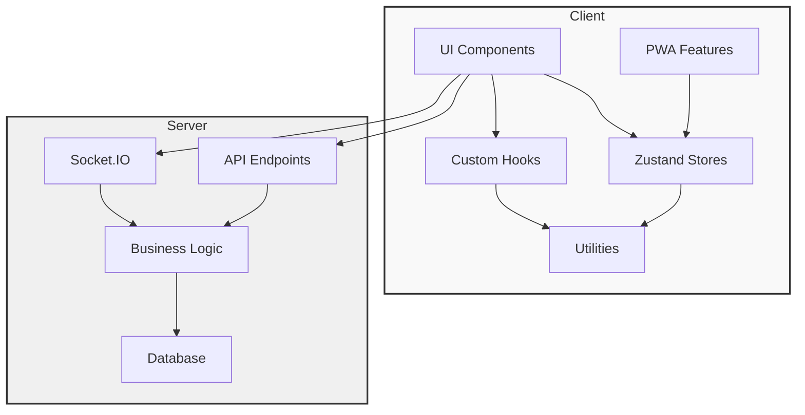
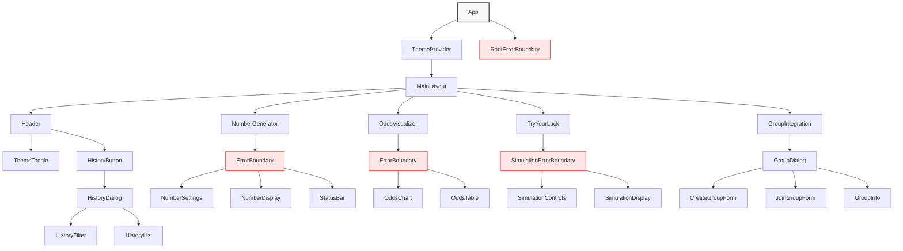
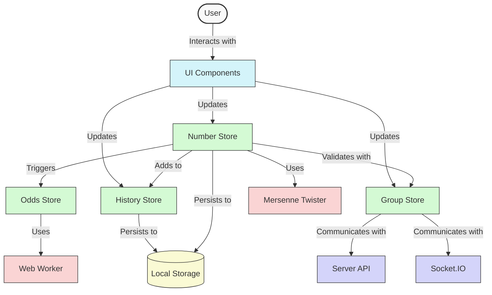
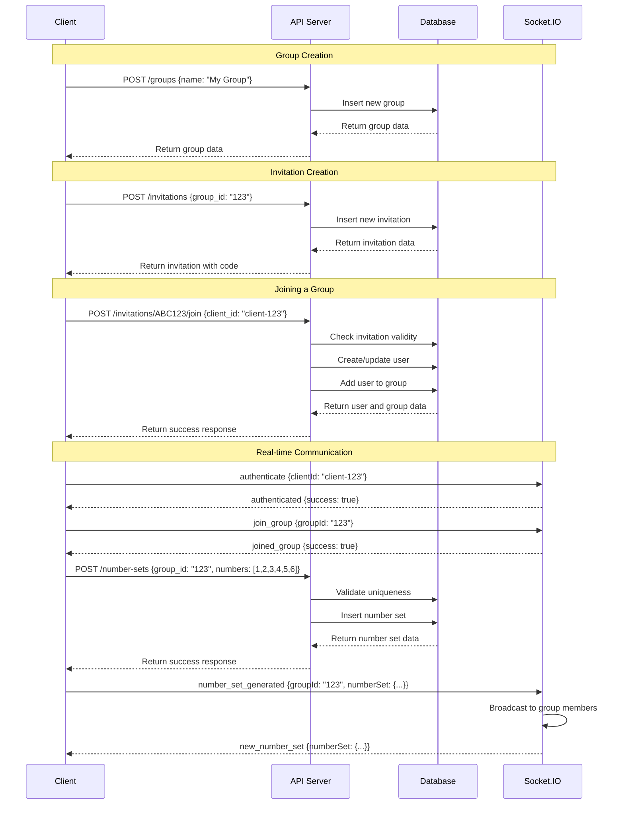
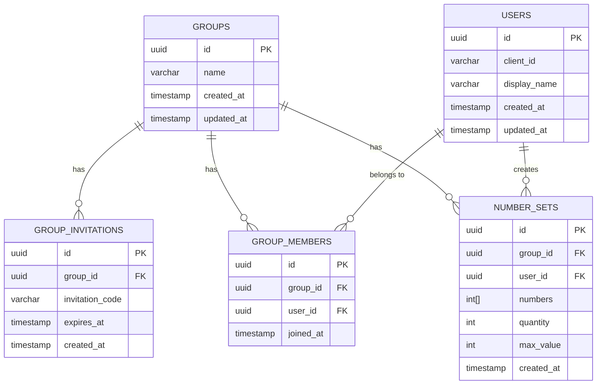

# Architecture Diagrams

This document provides visual representations of the Oddly lottery application architecture using Mermaid diagrams.

## Table of Contents

- [Application Architecture](#application-architecture)
- [Component Hierarchy](#component-hierarchy)
- [Data Flow](#data-flow)
- [API Request/Response Flow](#api-requestresponse-flow)
- [Database Schema](#database-schema)

## Application Architecture

The following diagram shows the high-level architecture of the Oddly application:

## Component Hierarchy

The following diagram shows the component hierarchy of the client-side application:

## Data Flow

The following diagram shows the data flow in the client-side application:

## API Request/Response Flow

The following diagram shows the API request/response flow for the group feature:

## Database Schema

The following diagram shows the database schema for the server-side application:

